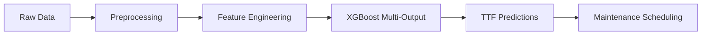

# 🛠️ Predictive Maintenance System using XGBoost

<div align="center">


*Proactive equipment maintenance through intelligent Time-To-Failure predictions*

[Demo](#-demo) • [Installation](#-installation) • [Usage](#-usage) • [API Reference](#-api-reference) • [Contributing](#-contributing)

</div>

---

## 🚀 Project Overview

**Predictive Maintenance** is a cutting-edge machine learning solution that transforms traditional reactive maintenance into a proactive, data-driven approach. Our system leverages advanced **XGBoost Multi-Output Regression** to predict equipment failures before they occur, potentially saving thousands in downtime costs.

### 🎯 Key Features

- **Multi-Component Prediction**: Simultaneously predicts failure times for 4 different machine components
- **Short-Term Accuracy**: Optimized for predictions under 10 weeks with ~91% accuracy
- **Real-Time Interface**: Flask-based web application for instant predictions
- **Industrial Ready**: Designed for real-world manufacturing environments
- **Comprehensive Pipeline**: End-to-end solution from data preprocessing to deployment

### 📈 Performance Metrics

| Metric | Value |
|--------|-------|
| **Test R²** | ~0.95 |
| **Test MAPE** | ~11.25% |
| **Short-Term MAE** | ~0.91 weeks |
| **Training Samples** | 200,000 (stratified) |

---

## 📁 Project Structure

```
predictive-maintenance/
├── 📂 model_code/
│   ├── 🐍 Model_XGB.py          # Main training pipeline
│   └── 🔮 manual.py             # Manual prediction script
│
├── 📂 flask_code/
│   ├── 🌐 app.py                # Flask backend server
│   └── 📂 templates/
│       └── 🎨 index.html        # Web interface
│
├── 📊 TTF_Dataset_Weeks.csv     # Training dataset
├── 📋 requirements.txt          # Python dependencies
├── 📜 README.md                 # Project documentation
└── 🎯 .gitignore               # Git ignore rules
```

---

## 🛠️ Installation

### Prerequisites

- Python 3.8 or higher
- pip package manager
- Git

### Quick Start

1. **Clone the Repository**
   ```bash
   git clone https://github.com/yourusername/predictive-maintenance.git
   cd predictive-maintenance
   ```

2. **Create Virtual Environment** (Recommended)
   ```bash
   # Windows
   python -m venv venv
   venv\Scripts\activate
   
   # macOS/Linux
   python3 -m venv venv
   source venv/bin/activate
   ```

3. **Install Dependencies**
   ```bash
   pip install -r requirements.txt
   ```

   Or install manually:
   ```bash
   pip install xgboost pandas scikit-learn flask matplotlib seaborn joblib numpy
   ```

---

## 🚀 Usage

### 1. Train the Model

```bash
cd model_code
python Model_XGB.py
```

**Output**: Trained model files (`model.pkl`, `scaler.pkl`, `encoders.pkl`)

### 2. Manual Predictions

```bash
python manual.py
```

Provide machine parameters and get TTF predictions for all components.

### 3. Web Application

```bash
cd flask_code
python app.py
```

🌐 **Access**: Open your browser to `http://127.0.0.1:5000`

**Features**:
- Upload machine data via web interface
- Real-time TTF predictions
- Visual results display
- Export predictions as CSV

---

## 📊 Dataset Overview

### Input Features

| Category | Features |
|----------|----------|
| **Sensor Data** | `volt`, `rotate`, `pressure`, `vibration` |
| **Machine Info** | `model`, `age`, `error_count` |
| **Maintenance** | `days_since_comp1_maint` to `days_since_comp4_maint` |

### Target Variables

- `ttf_comp1_weeks` - Time to failure for Component 1
- `ttf_comp2_weeks` - Time to failure for Component 2  
- `ttf_comp3_weeks` - Time to failure for Component 3
- `ttf_comp4_weeks` - Time to failure for Component 4

### Data Preprocessing

- **Stratified Sampling**: 200,000 representative samples
- **Feature Scaling**: StandardScaler normalization
- **Encoding**: Label encoding for categorical variables
- **Quality Assurance**: Outlier detection and handling

---

## 🧠 Machine Learning Architecture

### Model Pipeline



### Key Components

1. **Data Preprocessing**
   - Stratified sampling for balanced representation
   - Feature scaling and encoding
   - Missing value imputation

2. **Model Architecture**
   - XGBoostRegressor with MultiOutputRegressor wrapper
   - Custom hyperparameter tuning
   - Cross-validation for robust performance

3. **Evaluation Strategy**
   - Multiple metrics: RMSE, MAE, R², MAPE
   - Special focus on short-term predictions (<10 weeks)
   - Component-wise performance analysis

---

## 📊 Results & Performance

### Overall Performance

```
Component 1: R² = 0.94, MAPE = 10.8%
Component 2: R² = 0.95, MAPE = 11.2%
Component 3: R² = 0.96, MAPE = 11.5%
Component 4: R² = 0.95, MAPE = 11.4%
```

### Short-Term Accuracy (< 10 weeks)

- **Mean Absolute Error**: 0.91 weeks
- **Critical for**: Emergency maintenance scheduling
- **Business Impact**: Prevents unexpected downdowns

---

## 🔧 API Reference

### Flask Endpoints

#### POST `/predict`

Predict TTF for machine components.

**Request Body:**
```json
{
  "volt": 180.5,
  "rotate": 1200,
  "pressure": 85.2,
  "vibration": 45.1,
  "model": "Model_A",
  "age": 156,
  "error_count": 3,
  "days_since_comp1_maint": 45,
  "days_since_comp2_maint": 32,
  "days_since_comp3_maint": 67,
  "days_since_comp4_maint": 23
}
```

**Response:**
```json
{
  "predictions": {
    "component_1": 8.5,
    "component_2": 12.3,
    "component_3": 6.1,
    "component_4": 15.7
  },
  "status": "success",
  "timestamp": "2024-01-20T10:30:00Z"
}
```

---

## 🔬 Model Interpretability

### Feature Importance

The model considers these factors in order of importance:

1. **Vibration levels** - Primary indicator of component stress
2. **Days since last maintenance** - Critical for all components
3. **Machine age** - Long-term degradation factor
4. **Error count** - Operational stress indicator
5. **Sensor readings** - Real-time operational state

### SHAP Analysis

> 🚧 **Coming Soon**: SHAP-based feature importance and prediction explanations

---

## 🚀 Deployment

### Docker Deployment

```dockerfile
FROM python:3.9-slim

WORKDIR /app
COPY requirements.txt .
RUN pip install -r requirements.txt

COPY . .
EXPOSE 5000

CMD ["python", "flask_code/app.py"]
```

### Production Considerations

- **Scalability**: Consider using Gunicorn for production
- **Monitoring**: Implement logging and performance monitoring
- **Security**: Add authentication and input validation
- **Data Pipeline**: Automate model retraining with new data

---

## 🛣️ Roadmap

### Phase 1 (Current)
- [x] XGBoost multi-output model
- [x] Flask web interface
- [x] Basic performance metrics

---

## 🤝 Contributing

We welcome contributions! Please see our [Contributing Guidelines](CONTRIBUTING.md) for details.


---

## 📄 License

This project is licensed under the MIT License - see the [LICENSE](LICENSE) file for details.

---

## 👥 Team

<div align="center">

| [Dharam Patel](https://github.com/dharampatel) | [Ayesha Patel](https://github.com/ayeshapatel) | [Vrunda Radadiya](https://github.com/vrundapatel) |

</div>

---


## 🙏 Acknowledgments


---

<div align="center">

**⭐ Star this repository if it helped you!**

[Report Bug](https://github.com/yourusername/predictive-maintenance/issues) · [Request Feature](https://github.com/yourusername/predictive-maintenance/issues) · [Documentation](https://yourusername.github.io/predictive-maintenance)

</div>
